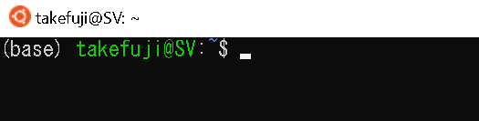
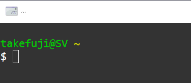

# preprocessing using bash for machine leaning

This repository is for novice how to use terminal commands 
(bash or zsh) for machine learning preprocessing and data manipulations.
<pre>
comm.pptx: basic bash commands
kwords.pptx: keywords search basic methods
strength_conclusion.docx: how to make strong statements using data
deduct_induct.pptx: reasoning for data scientist
twitterEncrypted.docx: twitter search
They were all encrypted. Use openssl command for decrypting.
openssl command can be automatically installed by miniconda.
</pre>

# Exercises for students

You should practice the following questions.

<pre>

0. What is a single character, a string?

1. Show your bash script on how many files and how many directories in the current directory respectively.
Hint: ls command

2. "ls -lt" shows a list of detailed files in time order. Show the list in English instead of in Japanese.

3. Delete blank lines in text
Hint: sed -i '/^$/d'

4. String replace using sed
$ echo 'i am a good boy'|sed 's/good/bad/g'
i am a bad boy

5. Show your script on how many commas in the first line of new_deaths.csv:

https://raw.githubusercontent.com/owid/covid-19-data/master/public/data/jhu/new_deaths.csv

Hints: 
A. $ head -1
B. $ cat file|tr -cd ,
or $ cat file|awk -F ',' '{print NF-1}'
or $ grep -o \, file  
or $ cat file|sed 's/[^,]//g'
C. $ wc -c or wc

6. Show only "Mounted on" column from result of df:
$ df
Filesystem     1K-blocks      Used Available Use% Mounted on
rootfs         233465860 105665500 127800360  46% /
none           233465860 105665500 127800360  46% /dev
none           233465860 105665500 127800360  46% /run
none           233465860 105665500 127800360  46% /run/lock
none           233465860 105665500 127800360  46% /run/shm
none           233465860 105665500 127800360  46% /run/user
tmpfs          233465860 105665500 127800360  46% /sys/fs/cgroup
C:\            233465860 105665500 127800360  46% /mnt/c
Hints: 
A. reduce multiple spaces to a single space per line using "tr -s ' '"
B. cut -d ' ' -f 6

7. Convert minus numbers to positive numbers in csv file.
https://raw.githubusercontent.com/owid/covid-19-data/master/public/data/jhu/new_deaths.csv

8. Explain "history|grep wget"

9. Explain $  ls -d \.[a-z]* |grep /

10. Create a list of unique IPs from /var/log/apache2/access.log
Hints: awk '{print $1}'
or
Hints: cut -d '-' -f 1
delimitter "-d" is a single character.
Hints: awk -F 'XXX' is equivalent to multiple characters as delimitter.

11. How to decrypt kwords.pptx
$ openssl enc -d -aes256 -in kwords.pptx >keywords.pptx
or
$ openssl enc -d -aes256 -in kwords.pptx >keywords.pptx -md sha256
$ openssl end -d -aes356 -in comm.pptx >commands.pptx

12. How to encode a file
$ openssl enc -e -in commands.pptx >comm.pptx

13. grep Failed auth.log|cut -d ' ' -f 11|grep  '\.'|sort|uni

14.  cat /var/log/auth.log|grep Failed|awk -F'from' '{print $2}'|cut -d ' ' -f 2|sort|uniq

15. counting the number of unique values
$ cat countries|sort|uniq -c|sort -nr

16. check /var/log/auth.log or /var/log/auth.log.1 and make a table of the number of attacks by country in order of frequency of attacks.
Hints: x.y.z.w is an IP address.
A. python ip2city.py  x.y.z.w
B. whois x.y.z.w
C. curl ipinfo.io/x.y.z.w
D. curl http://ipwhois.app/json/x.y.z.w
E. curl https://ipapi.co/x.y.z.w/json

17. How to silence output in a Bash?
Hint: 2>/dev/null
$ bash country3.sh >ttt 2>/dev/null 

18. Count the number of commas in text.
Hints: 
$ cat text
South Korea,India,Brazil,France,New Zealand,Taiwan,Sweden,Japan,United States,Canada,United Kingdom,Israel
A.
grep -o \, text
wc -l
B.
cat text|tr -cd , 
wc -c
C.
awk -F "," '{print NF-1}' text
D.
sed 's/[^,]//g'
E.
i=$(sed 's/,/\n/g' <text|wc -l);((i-=1));echo $i

</pre>

# bash shell or zsh

bash or zsh is very important for running a variety of programs. 
You should fill every command described in this list.
<pre>
Operating systems including Windows, Mac, and Linux have a default shell.
WSL (Windows Subsystem for Linux) and Linux (Ubuntu, Debian,...) 
have a default bash shell.
Mac has a default zsh. zsh is similar to bash.

In order to run shell, open terminal on your operating system.
Whenever starting shell, terminal window will be opened with 
the following prompt:

</pre>

# List of minimum commands

We can run any line commands (bash, apt, Python, Firefox,...). 
You must exercise yourself with the following commands. The followings 
are basic bash or zsh commands:

<pre>
apt cache search:

awk: a scripting language used for manipulating data and generating reports
  head -1 new_deaths.csv |awk -F ',' '{print NF-1}'

bc:

cat: to read and concatenate files and give their content as output

cd: to change directory

cmake:

crontab -e: an editor creating cron jobs

cut: a command for cutting out the sections from each line of files 
     and writing the result to standard output
  cut -d ' ' -f 6

df -h: to display information related to file systems about total 
       space and available space

dpkg -l:

echo: to display line of text/string that are passed as an argument

expect:

export DISPLAY=:0: to export a display to remote client

find:

gcc:

grep -rn: grep -o 

gzip -d file.gz: expanding .gz file 

hcitool scan:

head -x: reads first x lines of the file
  head -1 new_deaths.csv

ifconfig:

iwconfig:

kill -9:

ls: to list files or directories (folders)

make:

mkdir: to make directory

nmap:

nslookup:

ntp:

openssl:

pkill –f xxx:

ps: to provide information about the currently running processes 

pwd: to print working directory

rm:

scp:

sed: stream editor
  sed -n '3,4p' text
  sed '1,$s/  */ /g' text

sort:

ssh:
  ssh -Y
  
sshfs:

sudo apt install:

tar xvf xxx.tar:
  tar cvf xxx.tar dir

top:

touch: to create a file

tr -s : to transform string or delete characters from the string
  echo "my     is  432234" | tr -s ' '
  my is 432234
  echo "my username is 432234" | tr -cd ' a-z'
  my username is 

uniq: to report or filter out repeated lines in a file

unzip:

vi: screen editor 

wc:

wget:

while:

xargs: to read items from standard input as separated by blanks 
       and execute a command once for each argument

</pre>

